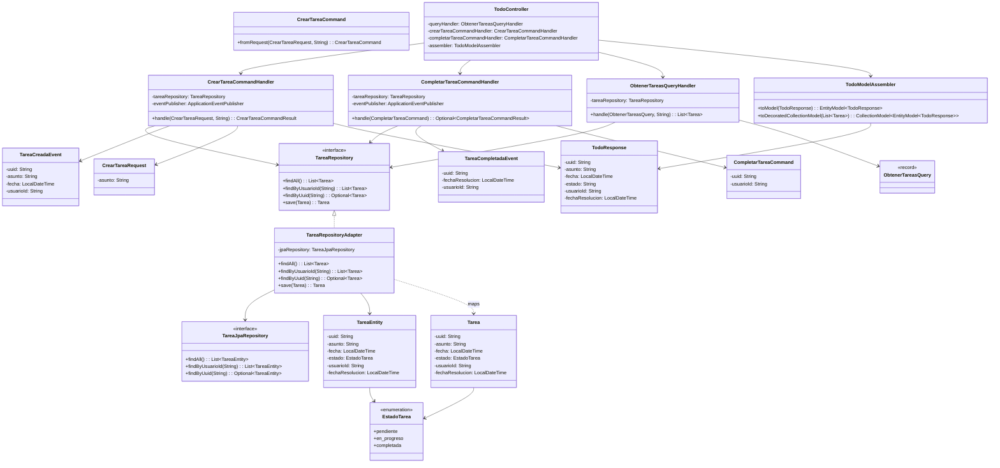

# Diagrama de Clases

## Descripción de Capas

### Domain Layer
- **Tarea**: Entidad principal del dominio
- **EstadoTarea**: Enumeración con los estados: pendiente, en_progreso, completada
- **TareaRepository**: Interfaz del puerto de repository
- **TareaCreadaEvent / TareaCompletadaEvent**: Eventos del dominio

### Application Layer
- **CrearTareaCommandHandler**: Maneja la creación de tareas
- **CompletarTareaCommandHandler**: Maneja la completado de tareas
- **ObtenerTareasQueryHandler**: Maneja la obtención de tareas
- **DTOs**: CrearTareaRequest, TodoResponse

### Adapter Layer
- **TodoController**: Controlador REST
- **TareaRepositoryAdapter**: Adaptador que implementa TareaRepository
- **TareaEntity**: Entidad JPA
- **TodoModelAssembler**: Ensamblador HATEOAS
