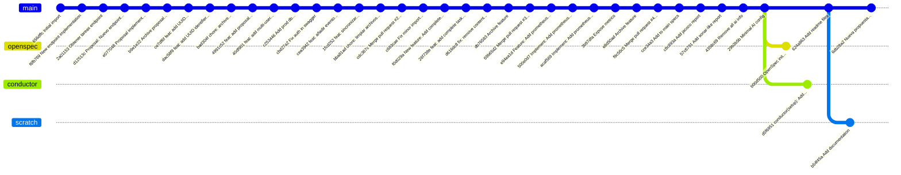

# Historial de Git del Proyecto

## Ramas del proyecto

| Rama | Descripción |
|------|-------------|
| **main** | Rama principal con el código en producción |
| **conductor** | Rama para configuración de conductor |
| **openspec** | Rama para especificación abierta |
| **scratch** | Rama de trabajo actual |

## Commits únicos por rama

- **main**: 624a863 (Add readme files), 6db28a2 (Nueva propuesta de ejemplo)
- **openspec**: b00d500 (OpenSpec init + basic config.yaml)
- **conductor**: d5f6951 (conductor(setup): Add conductor setup files)
- **scratch**: b54f45a (Add documentation)

## Último Commit

- **6db28a2**: Nueva propuesta de ejemplo
