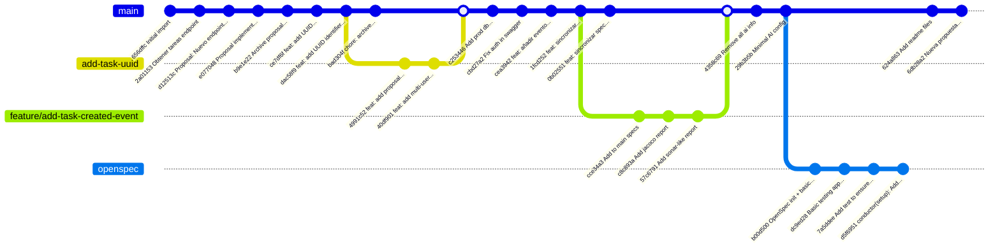

# Historial de Git del Proyecto

## Ramas del proyecto

- **main**: Rama principal con el código en producción
- **conductor**: Rama para configuración de conductor
- **openspec**: Rama para especificación abierta
- **scratch**: Rama de trabajo actual

## Último Commit

- **6db28a2**: Nueva propuesta de ejemplo
